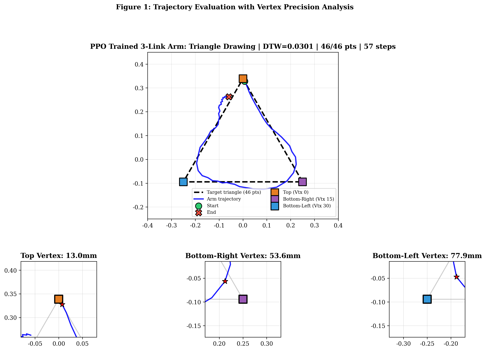

# PPO Reinforcement Learning for Robotic Arm Creative Drawing

A 3-link planar robotic arm learns to draw a closed triangle pattern via **Proximal Policy Optimization (PPO)** — no inverse kinematics, no demonstrations, just reward engineering.



## Results

| Metric | Value |
|--------|-------|
| DTW distance | **0.029** (min) / 0.032 (mean) |
| Success rate | **100%** (46 / 46 waypoints) |
| Top vertex precision | **15.6 mm** |
| Training steps | 600,000 |
| Algorithm | PPO (Stable-Baselines3) |

## Architecture

- **Robot**: 3-link planar arm (link lengths: 0.30 / 0.25 / 0.15 m)
- **Action space**: 3D continuous joint torques $[\tau_1, \tau_2, \tau_3] \in [-1, 1]$
- **Observation space**: 15D (joint angle sin/cos, angular velocities, EE position, current target, distance & progress)
- **Reward**: Segment-guidance + vertex-distance-dependent bonus $30 \cdot e^{-d \cdot 50}$

## Key Innovation

The reward function combines **segment-guidance** (rewarding proximity to the current target edge segment, not just the nearest point) with a **vertex-distance-dependent bonus** that exponentially amplifies precision at triangle corners. This dual signal enables the 3-link arm to trace all three edges sequentially and hit vertices with millimetre-level accuracy.

## Quick Start

```bash
# Clone
git clone https://github.com/Maybe1e/rl.git
cd rl

# Install dependencies
pip install -r requirements.txt

# Evaluate trained model
python -c "
import sys; sys.path.insert(0,'rl_project')
from env import RoboticArmDrawingEnv
from stable_baselines3 import PPO
import numpy as np, pickle

env = RoboticArmDrawingEnv(target_pattern='triangle', max_steps=600)
model = PPO.load('results/models/ppo_final.zip')
with open('results/models/vecnorm_final.pkl','rb') as f:
    orm = pickle.load(f).obs_rms

obs, _ = env.reset()
done = False
while not done:
    obs_n = np.clip((obs - orm.mean) / np.sqrt(orm.var + 1e-8), -10, 10)
    act, _ = model.predict(obs_n, deterministic=True)
    obs, _, done, _, info = env.step(act)
print(f'Visited: {info[\"visited\"]}/{info[\"total\"]} points')
env.close()
"

# Train from scratch
python rl_project/train.py
```

### ONNX Inference

```python
import onnxruntime as ort, numpy as np

sess = ort.InferenceSession('results/ppo_arm_drawing.onnx')
obs = np.random.randn(1, 15).astype(np.float32)
actions = sess.run(None, {'obs': obs})[0]  # shape (1, 3)
```

### Docker

```bash
docker build -t rl-arm-drawing .
docker run --gpus all -v $(pwd)/results:/app/results rl-arm-drawing
```

## Files

| Path | Description |
|------|-------------|
| `rl_project/env.py` | 3-link arm dynamics + Gymnasium RL environment |
| `rl_project/patterns.py` | Target pattern generators (triangle, circle, spiral, …) |
| `rl_project/config.py` | Hyperparameters and environment configuration |
| `rl_project/train.py` | PPO training script |
| `rl_project/eval.py` | Evaluation, metrics (DTW, Hausdorff), and visualization |
| `results/ppo_arm_drawing.onnx` | Final policy exported as ONNX (277 KB) |
| `results/demo_triangle.mp4` | 1-minute demo video |
| `write_report.md` | Full project report (ACM-style) |

## Dependencies

- Python ≥ 3.10
- PyTorch, stable-baselines3, Gymnasium
- ONNX + ONNX Runtime (for inference)
- NumPy, Matplotlib, SciPy

## License

Academic project — Applied Machine Learning 25/26.
