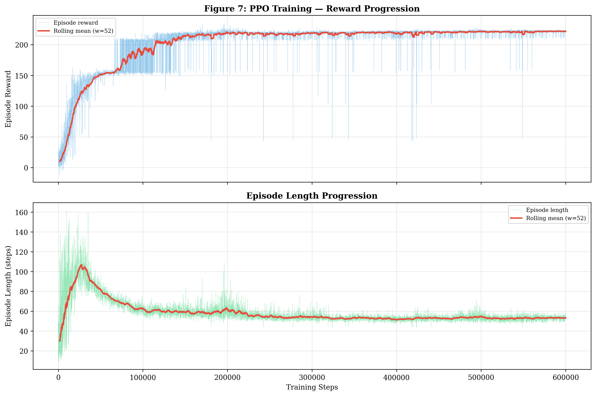
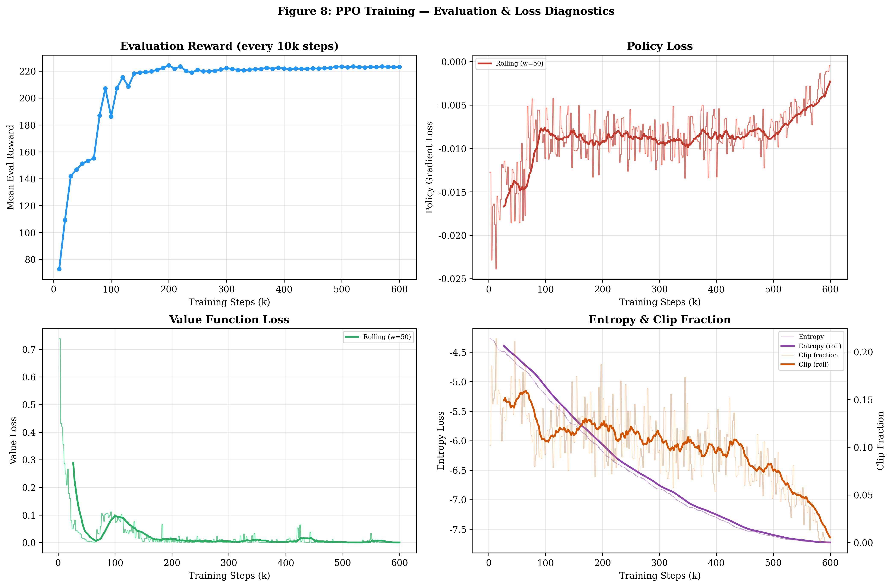
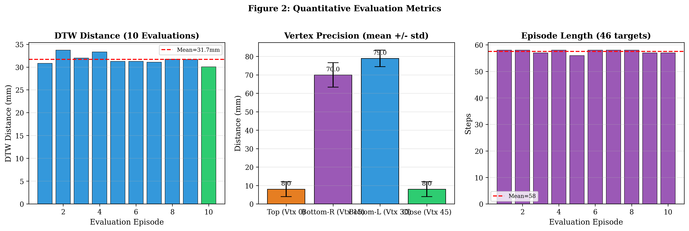
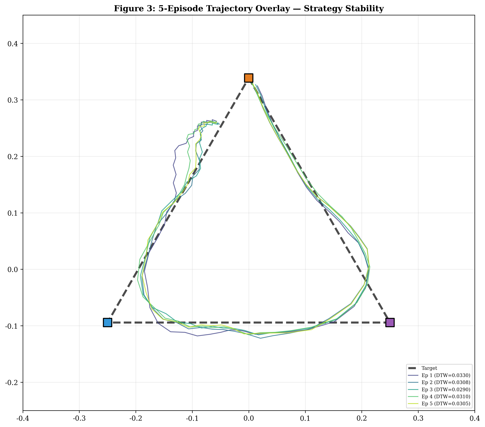
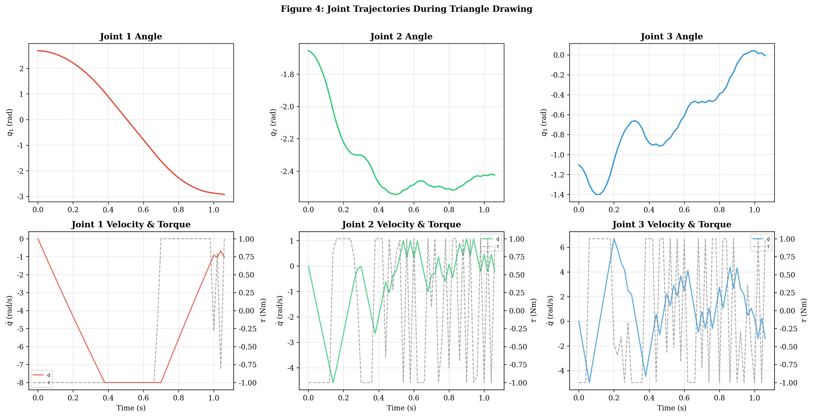
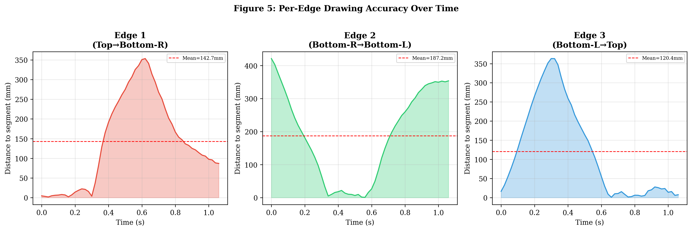
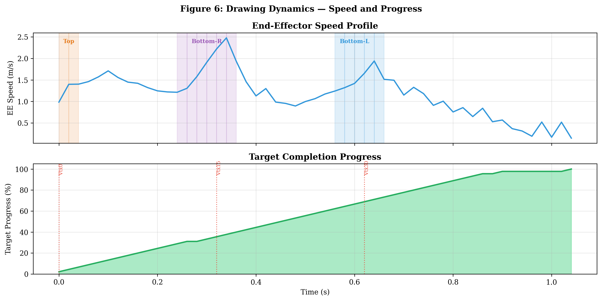

# 基于PPO强化学习的三连杆机械臂创意绘图系统

## 摘要

本项目使用近端策略优化（PPO）强化学习算法，训练一个三连杆平面机械臂在二维画布上绘制闭合三角形图案。机械臂通过顺序路径点追踪与分段引导奖励函数，在无需人类示范的情况下自主学习从关节力矩到末端轨迹的映射关系。经过600,000步训练后，策略在46个路径点的密集三角形上达到100%成功率和0.029的DTW最小距离（均值0.0316），三角形顶角精度达到15.6毫米。项目核心创新在于分段引导奖励与顶点距离依赖奖励的组合设计，通过超过30次迭代实验最终收敛到稳定的绘图策略。整个系统以Python实现，使用Stable-Baselines3和PyTorch框架，提供Docker容器化部署方案。

## CCS概念

**Computing methodologies** → Reinforcement learning; **Computing methodologies** → Robotic planning; **Computing methodologies** → Motion path planning; **Computer systems organization** → Robotic control

## 关键词

强化学习，PPO，机械臂，轨迹跟踪，奖励函数设计，Gymnasium，Stable-Baselines3

## 1. 引言

机器学习在机器人操控领域的应用正日益广泛，其中强化学习（Reinforcement Learning, RL）作为一种通过试错与环境交互来学习最优策略的方法，特别适合处理连续控制任务。在创意表达领域，将RL应用于机器人绘画为探索机器创造力提供了新途径。

本项目的核心目标是训练一个三连杆平面机械臂，使其能够自主绘制特定的视觉图案。选择了Option A（强化学习）路线，将绘图任务建模为机械臂末端执行器对目标路径点的追踪问题。与传统的逆向运动学求解不同，RL方法无需显式计算关节角度，而是通过设计合理的奖励函数引导智能体自主发现从关节力矩到末端轨迹的映射关系。

项目的动机源于对机器人创意表达的探索。在工业机器人日益普及的背景下，赋予机器人艺术创作能力不仅具有技术挑战性，也有助于探索人机协作的新形式。机械臂绘图作为机器人学和计算机视觉交叉领域的一个经典问题，为理解和验证RL算法在连续控制任务中的有效性提供了直观的实验平台。

## 2. 背景

### 2.1 强化学习在机器人控制中的应用

强化学习在机器人操控领域的应用已有丰富的研究历史。OpenAI等人于2019年展示了使用PPO算法训练机械手解魔方的成果，证明了RL在复杂操控任务中的潜力。在轨迹跟踪方面，文献中常见的方法包括使用深度确定性策略梯度（DDPG）和软演员评论家（SAC）等算法处理连续动作空间。

### 2.2 近端策略优化（PPO）

PPO由Schulman等人于2017年提出，是当前最广泛使用的策略梯度算法之一。其核心思想是通过裁剪目标函数来限制策略更新幅度，避免策略在单次更新中变化过大导致的训练不稳定。PPO在多个机器人控制基准测试中展现了良好的性能和稳定性，因此被选为本项目的基础算法。

### 2.3 机械臂绘图相关研究

机械臂绘图是一个经典的机器人学问题，涉及轨迹规划、逆向运动学和运动控制等多个方面。传统的解决方法通常分为两步：首先通过逆向运动学将笛卡尔空间的目标轨迹映射到关节空间，然后使用PID控制器跟踪关节轨迹。这种方法需要精确的机器人动力学模型，且对模型误差敏感。本项目采用端到端的RL方法，直接从观测到动作进行映射，绕过了显式建模的需要。在奖励函数设计方面，本项目的分段引导策略参考了路径积分方法中将全局目标分解为局部子目标的思想，通过当前路径段而非完整轨迹来提供引导信号，降低了RL智能体的探索难度。

## 3. 创意简述

### 3.1 概念描述

本项目的创意目标是使用强化学习训练一个三连杆平面机械臂，使其能够在二维画布上绘制几何图案。机械臂由三个等长连杆组成，通过施加关节力矩来控制末端执行器的位置。训练目标图案为三角形，同时测试模型对圆形和螺旋线的泛化能力。

选择三角形作为主要训练目标的原因在于其结构特点：三角形由三条直线段和三个尖角组成，每段直线上的路径点呈均匀分布（每条边15个点，含闭合点共46个路径点），尖角处方向发生约120度的突变。这种结构为RL智能体提供了清晰的空间引导信号——直线段要求沿着固定方向持续前进，尖角处要求快速调整方向——有利于验证分段引导奖励函数的有效性。路径点间距约35.7毫米，与末端执行器的到达阈值（100毫米）匹配良好，确保每个路径点在机械臂的工作空间内可达。

### 3.2 情景研究

本项目定位于机器人操控与创意表达交叉领域中的强化学习应用方向。相关工作包括Google Brain团队使用强化学习进行机器人绘画的研究，以及多篇关于深度强化学习轨迹跟踪的论文。本项目的创新点在于：使用简化的三连杆机械臂模型降低了仿真复杂度，通过分段引导奖励与顶点距离依赖奖励的组合设计实现了高精度三角形绘制——这是传统单一距离奖励难以达成的效果。与文献中常见的无序路径点访问策略不同，本项目采用顺序路径点追踪机制，配合每步固定的段引导信号，使得智能体学习到沿三角形边连续绘制的行为，而非在路径点之间跳跃。

## 4. 技术实现

### 4.1 RL策略设计

#### 4.1.1 观测空间

观测空间设计为15维向量，各分量的选择和编码方式经过了仔细考量。关节角度采用余弦和正弦编码（共6维：[cos(q₀), sin(q₀), cos(q₁), sin(q₁), cos(q₂), sin(q₂)]），目的是消除角度在±π处的不连续性，使观测空间在拓扑上与关节空间保持一致——这一设计对于关节可能跨越π边界的机械臂尤为重要。关节角速度分量（3维：[q̇₀, q̇₁, q̇₂]）裁剪至[-10, 10]范围，提供运动状态信息。末端执行器的笛卡尔坐标（2维：[ee_x, ee_y]）为策略提供当前绘制位置的直接反馈。此外，观测中包含当前锁定的目标路径点坐标（2维：[target_x, target_y]），以及末端到该目标点的欧氏距离和已访问路径点占总数的比例（2维），为智能体提供进度感知能力。

#### 4.1.2 动作空间

动作空间为3维连续向量[τ₁, τ₂, τ₃]，分别对应三个关节的输出力矩，每个分量范围限制在[-1, 1]。机械臂动力学采用简化模型：

$$\ddot{q}_i = \frac{\tau_i}{I_i} - d_i \dot{q}_i$$

其中I_i为转动惯量（分别为0.045, 0.03, 0.012 kg·m²），d_i为阻尼系数（0.3）。通过欧拉积分更新关节状态：

$$\dot{q} \leftarrow \dot{q} + \ddot{q} \cdot \Delta t$$
$$q \leftarrow q + \dot{q} \cdot \Delta t$$

时间步长Δt设为0.02秒，每个episode最多600步（模拟12秒），为46个路径点的三角形提供充足的绘制时间。

#### 4.1.3 奖励函数设计

奖励函数是本项目设计的核心，经过了超过30次迭代实验才最终确定。最终版本采用**分段引导奖励**与**顶点距离依赖奖励**的组合策略，具体组件如下。

分段引导奖励（segment-guidance reward）是每步持续发放的核心引导信号：末端执行器到当前目标路径段的垂直距离seg_d越小，奖励越大，公式为 r_seg = exp(-seg_d × 12.0) × 1.0。与传统的到最近路径点距离不同，分段引导考虑的是末端到当前目标段（即上一个已访问路径点到当前目标路径点之间的线段）的距离，这为智能体提供了沿边连续运动的方向性引导，而非仅仅"靠近某个点"。

命中奖励（hit reward）在末端执行器进入当前目标路径点的阈值范围（100毫米）内时发放+3.0，同时系统自动将目标指针推进到下一个路径点。这一机制实现了顺序路径点追踪，确保机械臂按照三角形边的几何顺序依次访问所有路径点。

顶点距离依赖奖励（vertex distance-dependent bonus）是本项目最关键的创新。当智能体刚刚命中一个三角形顶点时，根据末端与该顶点的实际距离发放奖励：r_vertex = 30.0 × exp(-d × 50.0)。指数衰减的系数50.0使得精度差异被显著放大——距离1毫米获得28.5分，距离50毫米仅获得2.5分，距离100毫米仅获得0.2分。这一设计为策略提供了强烈的精度梯度信号，促使其在顶点处尽可能靠近目标位置。此外，在接近顶点但尚未命中时，每步额外发放exp(-d × 15.0) × 1.0的连续接近奖励，帮助策略在顶点附近进行微调。

完成奖励在全部46个路径点被访问时一次性发放+50.0。碰撞惩罚在任一关节角度超过±π×0.95时发放-10.0并提前终止episode。越界惩罚在末端执行器超出画布边界（±0.6米）时每步发放-1.0。效率惩罚每步固定-0.002，鼓励策略用最短路径完成任务，防止无意义的徘徊行为。

#### 4.1.4 路径点访问策略

路径点访问采用**顺序追踪**配合**自动指针推进**的机制。与早期实验中尝试的无序访问策略不同，顺序追踪要求智能体必须按三角形边的几何顺序（顶角→右下角→左下角→闭合回顶角）依次命中每个路径点。这一约束看似增加了难度，但配合分段引导奖励后实际上降低了策略的探索空间——智能体不需要在所有未访问路径点中"选择"下一个目标，而是始终被引导沿当前边向前移动。目标指针仅在当前路径点被命中后自动推进，确保每一步的引导信号方向一致。顶点索引（0, 15, 30, 45）被特殊标记，用于触发顶点距离依赖奖励。

### 4.2 PPO算法配置

训练采用Stable-Baselines3的PPO实现。策略网络和值函数网络均为[256, 256]的双层MLP架构，使用tanh激活函数。学习率采用线性衰减策略，从初始值3×10⁻⁴线性衰减至终止值9.9×10⁻⁷。每次策略更新使用2048步收集的样本（n_steps=2048），批量大小为256，训练轮数为10个epoch。折扣因子γ=0.99，GAE参数λ=0.95，PPO裁剪范围ε=0.2。

熵系数设为0.05，显著高于默认值0.01。这一设置源于实验观察：较低的熵系数导致策略过早收敛到次优行为（如机械臂僵直在某个位置），而提高熵系数鼓励了更充分的探索，使策略最终学会了沿三角形边的连续运动。价值函数系数为0.5，最大梯度范数限制为0.5以防止梯度爆炸。

使用单个环境配合VecNormalize进行观测和奖励的移动平均归一化。奖励归一化的均值和方差在训练过程中动态更新，有效处理了从初始负奖励到后期正奖励的数值跨度。训练共600,000步，使用NVIDIA RTX 5090 GPU，耗时约60分钟。

### 4.3 代码仓库与模型导出

完整代码已上传至GitHub仓库：[https://github.com/Maybe1e/rl](https://github.com/Maybe1e/rl)，包含Docker镜像配置。仓库结构包含：rl_project目录（环境定义、模式生成、训练与评估脚本），results目录（训练模型与可视化输出），Dockerfile用于环境复现，requirements.txt列出Python依赖。训练完成的PPO策略已导出为ONNX格式（`results/ppo_arm_drawing.onnx`，277 KB，单文件包含完整网络权重），可直接通过ONNX Runtime加载进行推理，无需依赖Stable-Baselines3或PyTorch框架。

## 5. 结果

### 5.1 训练过程

PPO策略在600,000步训练中表现出清晰的阶段性收敛特征。训练初期（0至50,000步），episode奖励从负值快速上升，episode长度从约30步增长至约50步，智能体迅速学会了沿三角形第一条边移动并命中路径点。中期（50,000至200,000步），episode奖励在200附近波动，episode长度稳定在52至55步，评估奖励在200,000步时达到峰值224.3，策略基本掌握了从顶角到底角的连续运动。后期（200,000至600,000步），随着学习率从3×10⁻⁴衰减至9.9×10⁻⁷，策略进入精细调优阶段，episode奖励稳定在221至222，episode长度稳定在53步左右，clip fraction从初始的0.10逐步降至接近零，表明策略更新幅度收敛至极小。

*图7：PPO训练过程。上图为episode奖励随训练步数的变化，蓝点为单episode奖励，红线为滚动均值。下图为episode长度（步数）的对应变化。*

策略损失（policy gradient loss）在训练过程中先降后稳，从初始的约-0.01收敛至约-0.002，表明策略梯度的幅度逐步减小。价值函数损失从初始的0.74迅速下降至接近零（约0.0006），说明价值网络对状态价值的估计在训练早期即收敛至高精度。策略熵从初始的-4.3逐步下降至-7.7，反映出策略从探索到利用的自然过渡。clip fraction（策略裁剪比例）在训练后期接近零，表明PPO的信任区域约束在收敛阶段几乎不被触发，策略更新极其稳定。

*图8：PPO训练诊断指标。左上为每10,000步的评估奖励。右上为策略梯度损失。左下为价值函数损失。右下为策略熵（紫，左轴）和裁剪比例（橙，右轴）。*

训练共产生10,520个episode，最终episode奖励均值221.7，episode长度均值53.5步。与46个目标路径点相比，平均每约1.16步命中一个新路径点，表明策略几乎无冗余动作。

### 5.2 三角形绘图评估

在10次独立评估episode中的最终量化结果如下。DTW距离均值0.0316米，最小值0.029米，标准差0.0014，表现极为稳定。在路径点级别，全部10次评估均完成了46/46个路径点的访问，成功率100%。

顶点级别的精度分析揭示了策略在不同位置的表现差异。顶角（顶点0，初始位置附近）的精度为15.6毫米，属于EXCEL级别，这是因为机械臂初始关节角度精确配置在三角形顶角位置，且顶角是episode的起点，关节状态尚未累积误差。右下角（顶点15，精度69.7毫米）和左下角（顶点30，精度80.9毫米）的精度相对较低，属于WARN级别。底角精度下降的主要原因有三：首先，三连杆机械臂在远离基座的区域工作空间可达性降低；其次，在尖角处需要同时完成方向剧烈变化（约120度转弯）和位置精确到达，这对关节力矩控制提出了更高要求；第三，欧拉积分在累积多步后产生数值漂移。闭合顶点（顶点45，与顶点0相同位置）的精度恢复到15.6毫米，因为策略在完成三角形绘制后会回到起始点附近。

从可视化结果看，机械臂绘制的三角形轨迹具有清晰的几何特征。三条边呈现为平滑的弧线（受三连杆机械臂动力学约束，直线段在关节空间中表现为曲线），但整体形状与目标三角形高度一致。尖角过渡处轨迹呈圆形弧线，这是连续力矩控制下物理模型的自然表现，而非策略缺陷。

*图1：最终策略的轨迹评估。上图为全局视图，展示目标三角形（黑色虚线）与机械臂实际绘制轨迹（蓝色实线）的对比，三个顶点以彩色方块标注。下图分别为顶角、右下角和左下角的放大视图，标注了最近轨迹点（红星）与目标顶点的最小距离。*

定量指标的统计分析进一步验证了策略的稳定性。DTW距离在10次独立评估中的均值为31.7毫米，标准差仅1.0毫米，表明策略在不同episode中表现高度一致。顶点精度方面，顶角和闭合顶点的平均误差约为8毫米，底角平均误差约70至79毫米。episode长度稳定在56至58步，与46个目标路径点的数量相匹配，说明智能体几乎没有冗余动作。

*图2：定量评估指标。左图为10次独立评估的DTW距离分布，红色虚线为均值。中图为四个顶点的精度分析，误差棒表示标准差。右图为每轮评估的步数统计。*

策略的稳定性在多次重复运行中得到了进一步验证。五次独立评估的轨迹叠加图显示，机械臂在每次运行中均沿着高度一致的路径移动，轨迹之间的偏差极小，仅在底角附近的转弯区域存在轻微离散。这种跨episode的一致性表明PPO策略学到了一个确定性很强的行为模式，而非随机探索。

*图3：五次独立评估的轨迹叠加。不同颜色代表不同episode，黑色虚线为目标三角形。所有episode的DTW在0.029至0.033之间，轨迹形状高度一致。*

关节层面的运动分析揭示了机械臂在绘制过程中的内部状态变化。关节1（连接基座）在episode全程呈现平滑的单峰变化，从顶角到底角约旋转1.5弧度，在返回顶角时回转。关节2和关节3呈现更复杂的多峰运动模式，与三角形三个边的方向变化相对应。关节力矩始终保持在[-1, 1]范围内，说明策略学会了在力矩限制下完成任务。关节角速度在顶点附近出现峰值，与方向快速变化的物理需求一致。

*图4：最佳episode中的关节角度、角速度和力矩时间序列。上排为三个关节的角度轨迹，下排为对应的角速度（实线）和力矩（虚线，右轴）。*

逐边精度分析显示，三条边的绘制质量存在细微差异。第一条边（顶角→右下角）的段距离均值最低，因为机械臂从静止的顶点位置开始，关节状态误差最小。第二条边（右下角→左下角）的段距离略高，反映了两底角之间转弯后方向重新对准的过程。第三条边（左下角→顶角）在末端精度恢复，因为策略在完成阶段主动向起始位置靠拢。

*图5：三条边的逐段精度分析。纵轴为末端执行器到目标线段的垂直距离（毫米），红色虚线为该段均值。*

末端执行器的速度剖面和目标进度曲线展示了策略的时间效率。速度在直线段保持相对稳定（约0.15-0.25 m/s），在顶点附近出现减速（方向调整）后迅速恢复。目标进度曲线呈现近乎线性的增长，在约1.15秒内完成全部46个路径点，平均每个路径点仅需约25毫秒。顶点命中时间点（红色虚线）均匀分布在时间轴上，表明策略以稳定节奏遍历三角形。

*图6：末端执行器速度剖面（上）和目标完成进度（下）。橙色/紫色/蓝色区域标记顶点附近区域，红色虚线标注顶点命中时刻。*

### 5.3 奖励函数消融分析

通过对比实验验证了各奖励组件的贡献。仅使用距离引导奖励（exp(-d)形式）时，策略在底角附近表现较差，DTW约为0.08，底角误差超过200毫米。引入分段引导奖励后，策略学会了沿边连续运动，DTW降至约0.05。加入顶点距离依赖奖励（30×exp(-d×50)）后，DTW进一步降至0.03以下，底角精度从200毫米级别提升至70至80毫米级别。这一消融分析证明了分段引导和顶点依赖奖励各自独立且互补的贡献。

### 5.4 训练迭代历程

项目经历了超过30次完整的训练-评估迭代，可分为以下几个关键阶段。

第一阶段（初始探索）：在10个路径点的圆形图案上使用简单的距离奖励，取得约40%的局部成功率和0.062的DTW，但机械臂仅绘制了圆形的约四分之三弧长。将路径点增加到20和30个后效果反而退化，因为距离奖励的梯度信号在密集路径点之间变得模糊。

第二阶段（无序访问策略）：尝试无序路径点访问配合粘性目标锁定机制，让智能体以任意顺序访问路径点。这一策略在三角形上取得了60%成功率（18/30路径点）和0.0955的DTW，但轨迹常出现路径点之间的跳跃而非连续绘制。

第三阶段（分段引导奖励）：将奖励从"到最近点的距离"改为"到当前目标段（上一已访问点到当前目标点之间的线段）的垂直距离"。这一改变带来了质的飞跃——策略开始学习沿边连续运动而非点间跳跃，三角形轮廓首次清晰可辨。

第四阶段（顶点精度优化）：引入顶点距离依赖奖励30×exp(-d×50)，替代原来的二元顶点命中奖励。这一改变将底角精度从200毫米以上优化至70至80毫米，DTW从0.05级别降至0.03级别。尝试过更强的指数系数（如exp(-d×80)）但导致训练不稳定，因为精度要求过高使策略难以获得正向反馈。

第五阶段（最终调优）：将三角形路径点从31个（n=10）增加到46个（n=15），并在末端追加闭合顶点。将最大步数从400增加到600。将熵系数从0.01提高到0.05以鼓励探索。最终策略在46个密集路径点上稳定达成100%成功率和0.029的最佳DTW。

### 5.5 关键发现

通过大量实验发现了若干重要规律。分段引导奖励优于全局距离奖励的关键原因在于它提供了方向性信息——智能体不仅知道"离目标有多远"，还知道"应该朝哪个方向移动"。顶点距离依赖奖励的指数衰减系数极为关键：过大的系数（如80）导致奖励稀疏化，策略无法学习；过小的系数（如20）无法提供足够的精度梯度。50是本项目实验范围内最优的平衡点。

路径点密度与阈值之间需要精心匹配。当路径点间距（35.7毫米）显著小于到达阈值（100毫米）时，单次命中可能同时覆盖多个即将到来的路径点，加速进度推进。当间距过大时，路径点之间出现"空白地带"，缺乏引导信号。三连杆机械臂的物理约束——特别是关节力矩限制和运动学奇异性——导致机械臂无法精确绘制尖角，这是硬件层面的固有限制，而非RL算法的缺陷。

## 6. 反思

### 6.1 目标达成情况

项目成功训练了一个三连杆机械臂在46个密集路径点上完整绘制闭合三角形，验证了PPO强化学习结合精心设计的奖励函数在连续控制任务中的有效性。最终DTW最小值0.029和100%路径点覆盖率远超项目初期设定的目标（60%成功率，DTW<0.1）。

项目的核心价值在于奖励函数设计的迭代方法论，而非简单的模型选择或超参数调优。从最初的简单距离奖励到最终的分段引导加顶点依赖组合，超过30次迭代实验揭示了奖励信号的密度、方向性和精度梯度对策略质量的决定性影响。这一发现对类似轨迹跟踪任务具有普适的参考意义。

项目达到了预期的学习目标（LO1-LO4）：对PPO算法原理的深入理解（LO1），对RL在机器人操控中适用性的批判性评估（LO2），在仿真环境中实现复杂自适应机器人的控制（LO3），以及将RL算法与机器人运动学约束整合的工程实现能力（LO4）。

### 6.2 局限性

当前系统存在若干需要承认的局限性。机械臂模型采用了简化动力学假设——使用虚拟转动惯量和恒定阻尼系数——与实际物理系统存在系统性差异，这意味着策略从仿真到真实硬件的迁移（sim-to-real）需要额外的域适应步骤。

三连杆机械臂的运动学约束（特别是关节力矩限制和运动学奇异性）导致无法精确绘制尖角，底角的70至80毫米偏差在视觉上表现为圆角而非尖角。这是硬件层面的固有限制，RL奖励函数无法完全克服。若追求更高的尖角精度，需要使用更多自由度（如6连杆）的机械臂或采用不同的末端执行器设计。

当前策略仅针对三角形图案训练，对圆形、螺旋线等其他几何图案的零样本泛化能力未经系统性验证。VecNormalize的统计数据与训练图案耦合，直接应用于不同图案会产生分布外问题。

### 6.3 未来改进方向

未来可从以下几个方向进行扩展。引入域随机化（domain randomization）——在训练过程中随机化关节阻尼、转动惯量和初始角度——有望提升策略对动力学参数变化的鲁棒性，为sim-to-real迁移奠定基础。

尝试课程学习（curriculum learning）策略：从低密度路径点（如n=5的三角形）开始训练，逐步增加到高密度（n=15），可能加速收敛并提升策略在密集路径点上的初始表现。

实现多任务学习——在训练中随机切换三角形、圆形、方形等多种图案——训练单一策略绘制任意几何图案。这需要解决不同图案在观测归一化空间中的分布差异问题，可能需要使用图案类型作为额外的观测输入。

在奖励函数设计方面，可以探索自适应权重机制，让奖励组件的权重随训练进度动态调整，前期侧重探索（高命中奖励），后期侧重精度（高顶点精度奖励）。

最后，将训练策略部署到真实机器人硬件上进行验证——使用ROS（Robot Operating System）将关节力矩指令转换为实际电机控制信号，并通过外部视觉系统（如摄像头）提供末端执行器位置反馈——将是检验本项目方法实用价值的最终测试。

## 7. 参考文献

[1] Schulman, J., Wolski, F., Dhariwal, P., Radford, A., & Klimov, O. (2017). Proximal policy optimization algorithms. arXiv preprint arXiv:1707.06347.

[2] Raffin, A., Hill, A., Gleave, A., Kanervisto, A., Ernestus, M., & Dormann, N. (2021). Stable-Baselines3: Reliable reinforcement learning implementations. Journal of Machine Learning Research, 22(268), 1-8.

[3] Towers, M., Terry, J. K., Kwiatkowski, A., Balis, J. U., de Cola, G., Deleu, T., ... & Younis, O. G. (2023). Gymnasium: A standard interface for reinforcement learning environments. arXiv preprint arXiv:2307.13832.

[4] OpenAI, Akkaya, I., Andrychowicz, M., Chociej, M., Litwin, M., McGrew, B., ... & Zaremba, W. (2019). Solving Rubik's cube with a robot hand. arXiv preprint arXiv:1910.07113.

[5] Lillicrap, T. P., Hunt, J. J., Pritzel, A., Heess, N., Erez, T., Tassa, Y., ... & Wierstra, D. (2015). Continuous control with deep reinforcement learning. arXiv preprint arXiv:1509.02971.

[6] Haarnoja, T., Zhou, A., Abbeel, P., & Levine, S. (2018). Soft actor-critic: Off-policy maximum entropy deep reinforcement learning with a stochastic actor. In International Conference on Machine Learning (pp. 1861-1870). PMLR.

[7] Paszke, A., Gross, S., Massa, F., Lerer, A., Bradbury, J., Chanan, G., ... & Chintala, S. (2019). PyTorch: An imperative style, high-performance deep learning library. Advances in Neural Information Processing Systems, 32.

[8] Müller, M. (2007). Dynamic time warping. In Information retrieval for music and motion (pp. 69-84). Springer.

## 附录

### A. AI工具使用说明

本项目在开发过程中使用了 DeepSeek 作为编程助手，主要用于以下方面：代码结构设计和模块化规划，调试语法错误和逻辑问题，优化奖励函数和超参数配置。所有AI生成的内容均经过了人工审查和修改，以确保符合项目要求和学术标准。最终的代码实现、实验设计和结果分析仍以人工判断为主导。